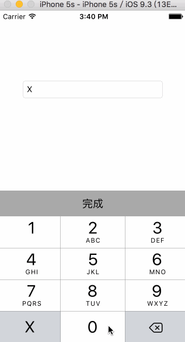

# JYJKeyBoard
身份证输入键盘

# GIF


# message
 `JYJKeyBoard` 用数字键盘输入身份证X

# Usage
 `JYJKeyBoard` 很简单，利用系统的键盘，省去自定义的麻烦，BXTextField是继承UITextField的，所以用法跟系统的也一样，下面是使用方法：

```
 // 创建textField，我这里直接用，你也可以继承BXTextField
 BXTextField *textField = [[BXTextField alloc] init];

 // 然后根据自己需要设置字体大小，颜色子类的，跟系统的完全一样

```


缺点：暂时不能用addTarget监听文字改变，只能应通知UITextFieldTextDidChangeNotification来监听

# 联系我
 QQ 453255376, 如有bug、不明白的，希望大家踊跃联系我，把程序写的更好。
 
